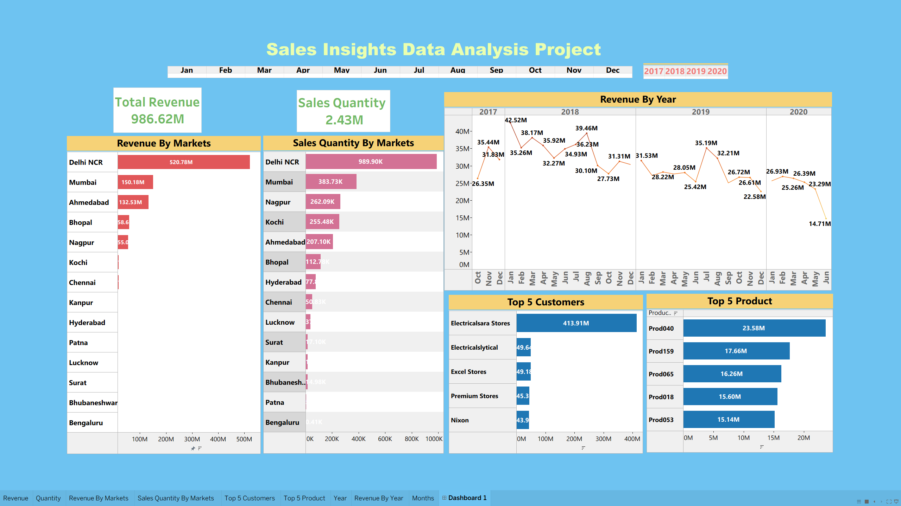

# 💼 Sales Insights — SQL + Tableau Project

### 📊 Overview
This project demonstrates an **end-to-end data analysis and visualization workflow** using **MySQL** for data extraction and transformation, and **Tableau** for interactive dashboarding. 

The case study is based on a **computer hardware business** facing challenges in a dynamically changing market. The goal is to empower decision-makers with **data-driven insights** to understand revenue patterns, sales performance, and market trends.

---

### 🧠 Objectives
- Understand and analyze **sales performance** across different markets and years.  
- Build SQL queries to extract, clean, and aggregate relevant data.  
- Create an **interactive Tableau dashboard** for visual storytelling and insights.  
- Derive **key business KPIs** like total revenue, top customers, and sales trends.

---

### ⚙️ Tech Stack
| Component | Description |
|------------|-------------|
| **Database** | MySQL |
| **Data Visualization** | Tableau |
| **Languages/Tools** | SQL, Tableau Desktop |
| **Dataset Source** | Provided via `db_dump.sql` |

---

### 📁 Folder Structure
Sales-Insights-SQL-Tableau/
 ── data/ # (Contains supporting datasets)
 ── db_dump.sql # MySQL database dump
 ── data_analysis_sales.sql # SQL queries used for data analysis
 ── sales_dashboard.twb # Tableau workbook file
 ── dashboard_ss.png # Screenshot of final Tableau dashboard
 ── README.md # Project documentation

---

### 🧩 Project Workflow

#### **1. Database Setup**
1. Install MySQL on your local system.   
2. Import the provided `db_dump.sql` file into MySQL to restore the database.

#### **2. Data Exploration & SQL Analysis**
Run sql queries after importing the data.

#### **3. Visualization in Tableau**

Once data was cleaned and aggregated using SQL:

- Imported into Tableau for visualization.
- Designed an interactive sales insights dashboard showing:
- Total Revenue (2017–2020)
- Yearly Sales Trends
- Market-wise Revenue Distribution
- Top Customers & Products

#### **4. Key Insights**

- Revenue grew steadily between 2017 and 2020.
- Certain markets (like Chennai) had consistent high performance.
- Top customers contributed significantly to overall revenue share.

#### **5. Conclusion**

This project reflects how real-world business intelligence solutions are built — from data extraction in SQL to interactive visualization in Tableau.
It’s a solid foundation for anyone aspiring to work as a Data Analyst or Business Intelligence Developer.